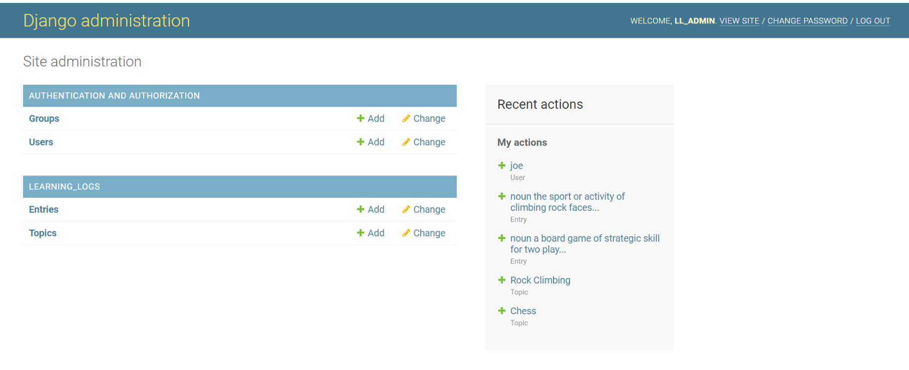
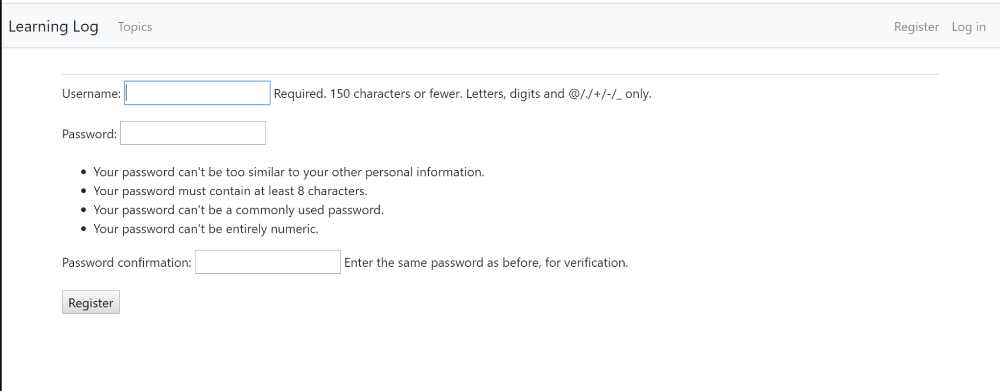

# Web Applications

## Chapter 18: GETTING STARTED WITH DJANGO
* Setting Up a Project
* Starting an App
* Making Pages: The Learning Log Home Page
* Building Additional Pages

## Chapter 19: USER ACCOUNTS
* Allowing Users to Enter Data
* Setting Up User Accounts
* Allowing Users to Own Their Data

## Chapter 20: STYLING AND DEPLOYING AN APP
* Styling Learning Log
* Deploying Learning Log

### Screen-shots


*Image of log in page*


*Image of log in page*	
		

*Image of admin log in*


*Image of admin main page*


*Image of new user register page*


*Image of user login*


*Image of user logout*

## Getting Started
### Prerequisities
To use Matplotlib for your initial set of visualizations, you’ll need to install it using pip, a module that downloads and installs Python packages.
**On Windows**
```
> cd python_work
python_work> python -m pip install --user matplotlib-1.4.3-cp35-none-win32.whl
```
**On Linux:**
**On OSX:**
#### Installing
This section will help you get a virtual environment set up.

- [Creating a Virtual Environment](#creating-a-virtual-environment)
- [Activating the Virtual Environment](#activating-the-virtual-environment)
    - [Deactivating the virtual environment](#deactivating-the-virtual-environment)
- [Installing virtualenv](#installing-virtualenv)
    - [Creating a virtual environment with virtualenv](#creating-a-virtual-environment-with-virtualenv)
- [Installing Django](#installing-django)

Creating a Virtual Environment
---
To work with Django, it's best to first set up a virtual environment. A virtual environment is a place on your system where you can install packages for one project and isolate those packages from the rest of your system. Using this approach, you can have many projects on your system without worrying about one project's packages interfering with another project's packages. Every project can have the exact version of the packages it needs, and you can update any one project's packages without affecting your other projects.

To get set up for Learning Log, make sure you have an empty folder somewhere on your system called *learning_log*.

If you're using Python 3, you should be able to create a virtual environment with the following command:

    learning_log$ python -m venv ll_env
    learning_log$

This command runs the *venv* module and uses it to create a virtual environment named ll_env.

If this works, move on to [Activating the Virtual Environment](#activating-the-virtual-environment). If it didn't work, go to [Installing virtualenv](#installing-virtualenv).

[top](#)

Activating the Virtual Environment
---

Now that you have a virtual environment set up, you'll need to activate it. On Linux and OS X, use the following command:

    learning_log$ source ll_env/bin/activate
    (ll_env)learning_log$

On Windows, run the following equivalent command:

    learning_log> ll_env\Scripts\activate
    (ll_env)learning_log>

This command runs the script *activate*, which is located in *ll_env/bin*. When the environment is active, you'll see the name of the environment in parentheses. This means you can install packages to the environment and use packages that have already been installed. Packages you install in *ll_env* will be available only when the environment is active; if you run into errors, make sure you see *(ll_env)* in parentheses at the beginng of your terminal prompt. If you don't see it, issue the *activate* command again.

### Deactivating the virtual environment

To stop using a virtual environment, enter **deactivate**:

    (ll_env)learning_log$ deactivate
    learning_log$

The environment will also become inactive if you close the terminal it's running in.

[top](#)

Installing virtualenv
---

If you're using an earlier version of Python or if your system isn't set up to use the *venv* module correctly, you can install the *virtualenv* package. To install virtualenv, enter the following:

    $ pip install --user virtualenv

You may use pip in a slightly different manner on your system; see [installing Python Packages](../chapter_12/installing_pip.md) if you need help using pip.

If you're using Linux and this still doesn't work, you can install virtualenv through your system's package manager. On Ubuntu, for example, the command **sudo apt-get install python-virtualenv** will install virtualenv.

### Creating a virtual environment with virtualenv

Change to the *learning_log* directory in a terminal, and create a virtual environment like this:

    learning_log$ virtualenv ll_env
    New python executable in ll_env/bin/python
    Installing setuptools, pip...done.
    learning_log$

If this works, move on to [Activating the virtual environment](#activating-the-virtual-environment).

If you have more than one version of Python installed on your system, you should specify the version for virtualenv to use. For example, the command **virtualenv ll_env --python=python3** wil create a virtual environment that uses Python 3.

[top](#)

Installing Django
---

In an active virtual environment, you can use pip to install Django:

    (ll_env)learning_log$ pip install Django
    Installing collected packages: Django
    Successfully installed Django
    Cleaning up...
    (ll_env)learning_log$

Because this command is run in a virtual environment, it's the same on all operating systems. There's no need to use the `--user` flag, and there's no need to use longer commands like `python -m pip install django`.

Keep in mind that Django will only be available when the virtual environment is active.
#### Troubleshooting
#### License
[top](#)
